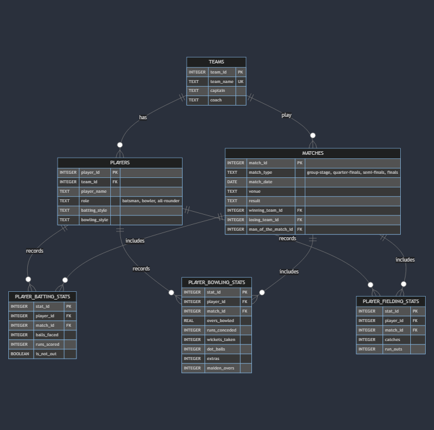

# Cricket Tournament Stats Database

By BALAJI T R

Video overview: <URL https://youtu.be/WkCaUdcMJbE>

## Scope

The purpose of this database is to manage statistics for a cricket tournament.

*  It includes information about teams, players, matches, and player performances.
* The database allows users to query and retrieve various statistics such as top run scorers, wicket takers, batting and bowling averages, fielding performances, and more.
* Detailed match events (e.g., boundaries, fall-of-wickets, etc.),Umpires and match officials are outside the scope

## Functional Requirements

* CRUD operations for all tables
* Users can query the database to retrieve statistics for teams and players.
* This includes top run scorers, wicket takers, batting and bowling averages, fielding performances, and more.
* Users cannot modify the structure of the database or perform administrative tasks.

## Representation

### Entities

### Teams

The `teams` table includes:

* `team_id` - `INTEGER`: Unique identifier for each team. This column is the `PRIMARY KEY`.
* `team_name` - `TEXT`: Name of the team. This column has a UNIQUE constraint to ensure each team has a unique name.
* `captain` - `TEXT`: Captain of the team.
* `coach` - `TEXT`: Coach of the team.

### Players

The `players` table includes:

* `player_id` - `INTEGER`: Unique identifier for each player. This column is the `PRIMARY KEY`.
* `team_id` - `INTEGER`: Identifier of the team to which the player belongs. This column has a `FOREIGN KEY` constraint referencing the `team_id` in the `teams` table.
* `player_name` - `TEXT`: Name of the player.
* `role` - `TEXT`: Role of the player (batsman, bowler, all-rounder).
* `batting_style` - `TEXT`: Style of batting (e.g., right-arm batsman).
* `bowling_style` - `TEXT`: Style of bowling (e.g., right-arm seamer).

### Matches

The `matches` table includes:

* `match_id` - `INTEGER`: Unique identifier for each match. This column is the `PRIMARY KEY`.
* `match_type` - `TEXT`: Type of the match (group-stage, quarter-finals, semi-finals, finals).
* `match_date` - `DATE`: Date of the match.
* `venue` - `TEXT`: Venue of the match.
* `result` - `TEXT`: Result of the match.
* `winning_team_id` - `INTEGER`: Identifier of the winning team. This column has a `FOREIGN KEY` constraint referencing the `team_id` in the `teams` table.
* `losing_team_id` - `INTEGER`: Identifier of the losing team. This column has a `FOREIGN KEY` constraint referencing the `team_id` in the `teams` table.
* `man_of_the_match_id` - `INTEGER`: Identifier of the player who was the man of the match. This column has a `FOREIGN KEY` constraint referencing the `player_id` in the `players` table.

### Player Batting Stats

The `player_batting_stats` table includes:

* `stat_id` - `INTEGER`: Unique identifier for each batting stat. This column is the `PRIMARY KEY`.
* `player_id` - `INTEGER`: Identifier of the player. This column has a `FOREIGN KEY` constraint referencing the `player_id` in the `players` table.
* `match_id` - `INTEGER`: Identifier of the match. This column has a `FOREIGN KEY` constraint referencing the `match_id` in the `matches` table.
* `balls_faced` - `INTEGER`: Number of balls faced by the player.
* `runs_scored` - `INTEGER`: Number of runs scored by the player.
* `is_not_out` - `BOOLEAN`: Indicates if the player was not out.

### Player Bowling Stats

The `player_bowling_stats` table includes:

* `stat_id` - `INTEGER`: Unique identifier for each bowling stat. This column is the `PRIMARY KEY`.
* `player_id` - `INTEGER`: Identifier of the player. This column has a `FOREIGN KEY` constraint referencing the `player_id` in the `players` table.
* `match_id` - `INTEGER`: Identifier of the match. This column has a `FOREIGN KEY` constraint referencing the `match_id` in the `matches` table.
* `overs_bowled` - `REAL`: Number of overs bowled by the player.
* `runs_conceded` - `INTEGER`: Number of runs conceded by the player.
* `wickets_taken` - `INTEGER`: Number of wickets taken by the player.
* `dot_balls` - `INTEGER`: Number of dot balls bowled by the player.
* `extras` - `INTEGER`: Number of extras conceded by the player.
* `maiden_overs` - `INTEGER`: Number of maiden overs bowled by the player.

### Player Fielding Stats

The `player_fielding_stats` table includes:

* `stat_id` - `INTEGER`: Unique identifier for each fielding stat. This column is the `PRIMARY KEY`.
* `player_id` - `INTEGER`: Identifier of the player. This column has a `FOREIGN KEY` constraint referencing the `player_id` in the `players` table.
* `match_id` - `INTEGER`: Identifier of the match. This column has a `FOREIGN KEY` constraint referencing the `match_id` in the `matches` table.
* `catches` - `INTEGER`: Number of catches taken by the player.
* `run_outs` - `INTEGER`: Number of run outs executed by the player.

### Relationships

## Optimizations

* Indexes were created on `player_id` and `match_id` columns in `player_batting_stats`, `player_bowling_stats`, and `player_fielding_stats` tables to improve query performance when retrieving player statistics for specific matches.
* View named `team_players_view` that shows all the teams and players particiating in the tournament.

## Limitations

* The database does not include detailed match events or information about umpires and match officials. It might not be able to represent complex match scenarios or events that are not captured in the provided entities and relationships ( like super over, DLS, etc.).
